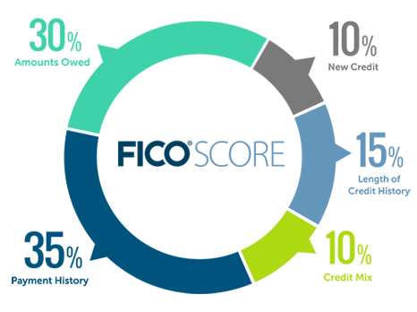

# Tìm hiểu về credit score
***
## 1. Credit score là gì?
- Credit score hiểu đơn giản là cách mà một 'agent' đánh giá về uy tín của một người nào đó. Mỗi agent có một cách đánh giá riêng theo tiêu chí của họ, từ đó xem xét có nên cho người đó vay hay không.
***
## 2. Một số tiêu chí cơ bản để đánh giá uy tín tín dụng của một người.
- **Credit History: Độ tuổi tín dụng (chiếm khoảng 15%)** 
-Tiêu chí này dựa trên độ tuổi trung bình các món nợ cộng lại
. Độ tuổi này được tính theo tháng.\
  Mình có 1 cái thẻ tín dụng mở vào tháng 1 / 2016, tính đến nay là 36 tháng tuổi\
  Mình có 1 chiếc xe mua trả góp vào tháng 1/2017, tính đến nay là 24 tháng tuổi\
  Mình mới mở một thẻ Macy vào tháng 6 năm 2018, tính đến nay là 7 tháng tuổi\
  ==> Độ tuổi tín dụng của mình là (36 + 24 + 7) / 3 = 22 tháng tuổi.
- **Credit Mix: Số lượng và số loại nợ (chiếm khoảng 10% điểm tín dụng)**
-Nhiều người lầm tưởng ít nợ mới tốt, nhưng không phải như vậy, càng nhiều nợ thì điểm mới càng cao. 
Nhiều ở đây là nhiều tài khoản nợ và thuộc nhiều loại nợ khác nhau thì càng tốt. Có 3 loại tài khoản nợ.
  * Revolving (nợ có thể xoay vòng): là loại tài khoản nợ có hạn mức, mà khi xài rồi trả nợ xong chúng ta có thể tiếp tục được xài nữa. Thẻ credit card, store credit card là 1 dạng revolving account như vậy
  * Installment (nợ trả góp): là nợ chúng ta mượn 1 lần rồi trả dần dần gốc và lời trong nhiều tháng. Ví dụ khi mua đồ ở các store trả góp, nợ student loan hay nợ mua xe chính là loại nợ này
  * Mortgage: nợ có thế chấp nhà. Đây cũng là 1 dạng trả góp, nhưng vì nó có thời gian vay lâu dài lên đến 30 năm, nên nó được phân loại riêng.\
Chúng ta nên có cả 3 loại nợ như trên thì điểm mới có khả năng lên cao được. Nếu có nhiều nợ, mà tất cả đều là credit card thì cũng không được xem là đa dạng loại nợ, nên điểm cũng không lên cao được.\
Nhiều ở đây là nhiều nợ nhưng vẫn có nhiều income để cover cho các khoản nợ, tức là tỷ lệ giữa số nợ phải trả hang tháng trên tổng income hàng tháng không được vượt quá 50%. Thật ra tỷ lệ 50% này không được tính vô điểm tín dụng, nhưng nó là cơ sở khi lender xét cho vay nên chúng ta phải lưu ý.
- **Credit Utilization: Phần trăm sử dụng các hạn mức nợ (chiếm tỷ lệ khoảng 30% điểm tín dụng)**
-Tỷ lệ này áp dụng với tất cả các món nợ có thể xoay vòng (revolving account), lấy tổng dư nợ của các món này chia cho tổng hạn mức của các món nợ.\
Tỷ lệ này càng thấp càng tốt, thậm chí nên duy trì dưới 5% - 10% .\
Nếu tỷ lệ này vượt quá 30% thì điểm sẽ giảm. và tất nhiên nếu tỷ lệ này ở mức 80% - 90% thì điểm càng giảm nhiều hơn nữa.
- **Credit inquiries: Số lần bị xem báo cáo tín dụng (chiếm khoảng 10% điểm tín dụng)**
Việc “bị” xem báo cáo tín dụng nhiều chứng tỏ quý vị đang có nhu cầu mượn thêm nợ nhiều. Tuy vậy, tiêu chí này ảnh hưởng đến điểm không đáng kể. Thậm chí, khi mới bị pull credit thì điểm chỉ giảm một vài điểm, nhưng chỉ sau 1 vài tháng thì điểm có thể được dễ dàng lên lại.\
Số lần bị xem này có hai loại là loại xem nhẹ (soft inquiry) hay xem nặng (hard inquiry). Xem nhẹ là khi xem chỉ để làm pre-approval chứ không phải là quyết định cho vay, hoặc khi các hãng điện nước gas check credit để ký hợp đồng,... các lần soft inquiry như vậy hoàn toàn không ảnh hưởng đến điểm tín dụng.\
Số lần bị xem này được lưu lại trong báo cáo tín dụng trong vòng 12 tháng. Tức là ví dụ quý vị bị pull credit vào tháng 10/2017, thì trong credit report tháng  10/2018 sẽ không tính đến lần pull credit đó.
- **Payment history: Lịch sử trả nợ (chiếm khoảng 35% điểm tín dụng)**
Đây là yếu tố ảnh hưởng lớn nhất  đến điểm tín dụng
  - **Số lần trả trễ hạn**\
Số ngày trễ hạn được xếp theo 30 ngày  – 60 ngày – 90 ngày trở lên. Số ngày trễ hạn càng cao thì điểm càng làm giảm nhiều điểm.\
Số lần bị trả trễ hạn sẽ được lưu lại trên báo cáo tín dụng trong vòng 7 năm. \
  - **Các vết đen trong báo cáo táo tín dụng bao gồm:**
    - Charge off: đây là món nợ trễ hạn trên 120 ngày, chủ nợ sẽ xem là nợ khó trả và chuyển ra theo dõi đòi nợ riêng. Thông thường đây là những món nợ thẻ tín dụng, không có tài sản thế chấp.
    - Collection: là những món nợ sau một thời gian theo dõi trên “charge off” mà chủ nợ không thể đòi nợ được nữa và chuyển sang cho bên thứ 3 chuyên đi đòi nợ. Hoặc chúng ta cũng thường thấy collection là từ các hãng bán hàng và dịch vụ, họ không chuyên về việc đòi nợ nên khi gởi bill 1-2 lần trong vòng 1-2 tháng mà không thấy trả nợ, họ sẽ chuyển ngay qua collection luôn.
    - Foreclose: Đây là khi không trả nợ được nhà, lender bắt buộc người mượn nợ phải bán nhà để trả nợ
    - Bankruptcy: khi một người lâm vào hoàn cảnh nợ nần chồng chất không có khả năng thanh toán, họ có thể khai phá sản để được xoá nợ và làm lại từ đầu.
Những vết đen này ảnh hưởng trầm trọng đến báo cáo tín dụng, bởi vì không chỉ nó làm giảm điểm tín dụng, mà khi lender thấy trong báo cáo tín dụng còn những món nợ như thế này họ cũng ngần ngại cho vay. Thêm vào đó, nếu như những món nợ charge off hay collection được trả off xong rồi thì nó vẫn còn được lưu lại trên báo cáo tín dụng trong vòng 7 năm kể từ ngày được trả.

  

 ***
